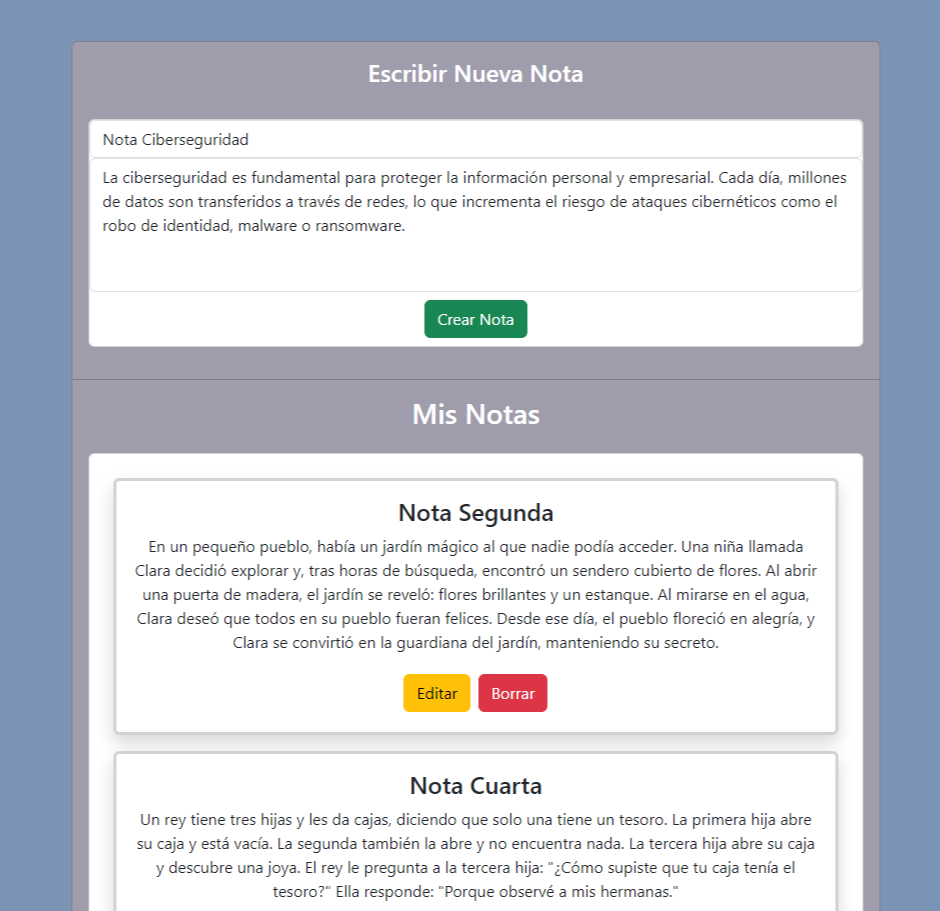
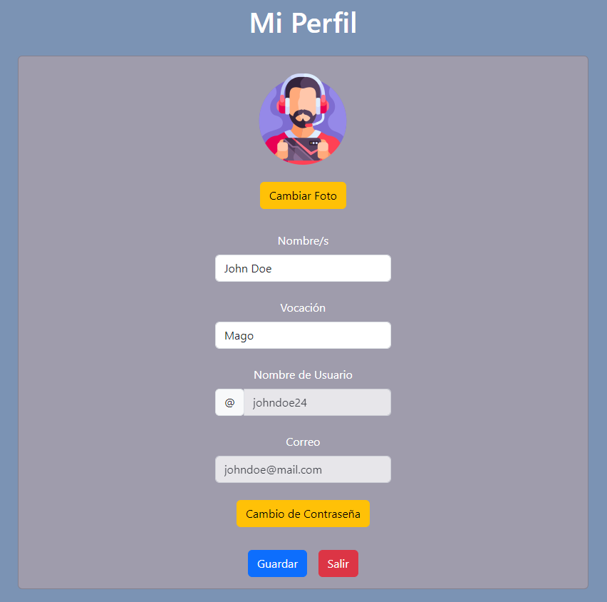
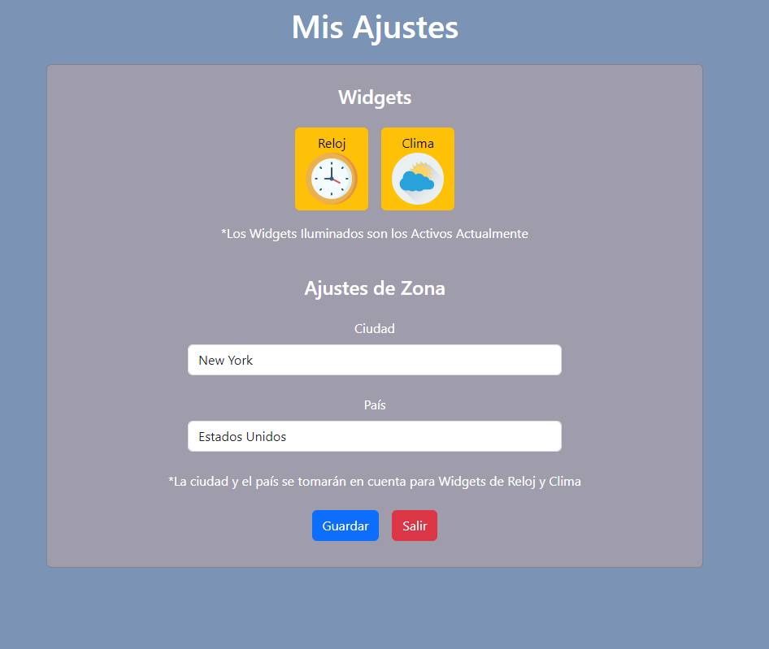

Proyecto Personal
# MyDesk

MyDesk una aplicación web con enfoque en un escritorio web donde se pueden escribir notas personales, tales como recordatorios, notas personales, recetas de comida, entre otras.  

## Demo
Demostración en 
<a href="https://mydeskang.netlify.app/" target="_blank">Netlify.com</a>

## Vistas

### - Registro de Usuario

  

### - Acceso de Usuario

  

### - Página Principal

  

### - Escritura de Notas

  

### - Edición de Notas

  

### - Perfil de Usuario

  

### - Ajustes de Usuario

## Funciones Principales
- Acceso/Registro de Usuario
- Datos/Configuración de Usuario en Cloud
- Escritura, Edición y Borrado de Notas en Cloud
- Widgets Clima y Reloj Personalizados
- Responsive (Ajustable a Pantallas Pequeñas)

## Tecnologías Utilizadas
- Front-End: 
	- Angular Framework v18.2
	- Lenguaje TypeScript

- CSS:
	- Bootstrap v5.3
	- CSS Puro para Detalles

- Otras:
	- Cloud Firestore
	- Firebase Authentication 
	- Firebase Storage
